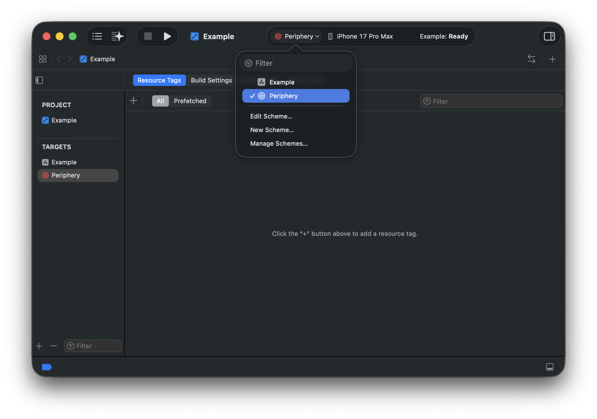

<h1 align="center">
  
  <br>
  Periphery
</h1>

<h4 align="center">A tool to identify unused code in Swift projects.</h4>
<p align="center"><q><i>Now I am become Delete, the destroyer of codes.</i></q></p>

<p align="center">
<a href="https://github.com/peripheryapp/periphery/releases/latest">
</a>

<a href="#sponsors-">

</a>
<br>
<br>
</p>

## Contents

- [Installation](#installation)
- [How To Use](#how-to-use)
- [Analysis](#analysis)
    - [Function Parameters](#function-parameters)
    - [Protocols](#protocols-1)
    - [Enumerations](#enumerations)
    - [Assign-only Properties](#assign-only-properties)
    - [Redundant Public Accessibility](#redundant-public-accessibility)
    - [Unused Imports](#unused-imports)
    - [Objective-C](#objective-c)
    - [Codable](#codable)
    - [XCTestCase](#xctestcase)
    - [Interface Builder](#interface-builder)
- [Comment Commands](#comment-commands)
- [Xcode Integration](#xcode-integration)
- [Excluding Files](#excluding-files)
- [Continuous Integration](#continuous-integration)
- [Build Systems](#build-systems)
- [Platforms](#platforms)
- [Troubleshooting](#troubleshooting)
- [Known Bugs](#known-bugs)
- [Sponsors](#sponsors-) 

## Installation

### [Homebrew](https://brew.sh/)

```sh
brew install periphery
```

### [Mint](https://github.com/yonaskolb/mint)

```sh
mint install peripheryapp/periphery
```

### [Bazel](https://bazel.build/)

```python
bazel_dep(name = "periphery", version = "<version>", dev_dependency = True)
use_repo(use_extension("@periphery//bazel:generated.bzl", "generated"), "periphery_generated")
```

See [Bazel](#build-systems) below for usage instructions.

## How To Use

### The `scan` Command

The scan command is Periphery's primary function. To begin a guided setup, change to your project directory and run:

```sh
periphery scan --setup
```

The guided setup will detect your project type and configure a few options. After answering a few questions, Periphery will print out the full scan command and execute it.

The guided setup is only intended for introductory purposes. Once you are familiar with Periphery, you can try some more advanced options, all of which can be seen with `periphery help scan`.

To get the most from Periphery, it’s important to understand how it works. Periphery first builds your project; it does this to generate the “index store”. The index store contains detailed information about the declarations (class, struct, func, etc.) in your project and their references to other declarations. Using this store, Periphery builds an in-memory graph of the relational structure of your project, supplementing it with additional information obtained by parsing each source file. Next, the graph is mutated to make it more suitable for detecting unused code, e.g., marking your project’s entry points. Finally, the graph is traversed from its roots to identify unreferenced declarations.

> [!TIP]
> The index store only contains information about source files in the build targets compiled during the build phase. If a given class is only referenced in a source file that was not compiled, then Periphery will identify the class as unused. It's important to ensure you build all the targets you expect to contain references. For an Xcode project, this is controlled using the `--schemes` option. For a Swift package, all targets are built automatically.

If your project consists of one or more standalone frameworks that do not also contain some kind of application that consumes their interfaces, you need to tell Periphery to assume that all public declarations are used with the `--retain-public` option.

For projects that are mixed Objective-C & Swift, it's highly recommended you [read about the implications](#objective-c) this can have on your results.

### Configuration

Once you've settled upon the appropriate options for your project, you may wish to persist them in a YAML configuration file. The simplest way to achieve this is to run Periphery with the `--verbose` option. Near the beginning of the output, you will see the `[configuration:begin]` section with your configuration formatted as YAML below. Copy & paste the configuration into `.periphery.yml` in the root of your project folder. You can now simply run `periphery scan` and the YAML configuration will be used.

## Analysis

The goal of Periphery is to report instances of unused _declarations_. A declaration is a `class`, `struct`, `protocol`, `function`, `property`, `constructor`, `enum`, `typealias`, `associatedtype`, etc. As you'd expect, Periphery can identify simple unreferenced declarations, e.g., a `class` that is no longer used anywhere in your codebase.

Periphery can also identify more advanced instances of unused code. The following section explains these in detail.

### Function Parameters

Periphery can identify unused function parameters. Instances of unused parameters can also be identified in protocols and their conforming declarations, as well as parameters in overridden methods. Both of these scenarios are explained further below.

#### Protocols

An unused parameter of a protocol function will only be reported as unused if the parameter is also unused in all implementations.

```swift
protocol Greeter {
    func greet(name: String)
    func farewell(name: String) // 'name' is unused
}

class InformalGreeter: Greeter {
    func greet(name: String) {
        print("Sup " + name + ".")
    }

    func farewell(name: String) { // 'name' is unused
      print("Cya.")
    }
}
```

> [!TIP]
> You can ignore all unused parameters from protocols and conforming functions with the `--retain-unused-protocol-func-params` option.

#### Overrides

Similar to protocols, parameters of overridden functions are only reported as unused if they're also unused in the base function and all overriding functions.

```swift
class BaseGreeter {
    func greet(name: String) {
        print("Hello.")
    }

    func farewell(name: String) { // 'name' is unused
        print("Goodbye.")
    }
}

class InformalGreeter: BaseGreeter {
    override func greet(name: String) {
        print("Sup " + name + ".")
    }

    override func farewell(name: String) { // 'name' is unused
        print("Cya.")
    }
}
```

#### Foreign Protocols & Classes

Unused parameters of protocols or classes defined in foreign modules (e.g. Foundation) are always ignored since you do not have access to modify the base function declaration.

#### fatalError Functions

Unused parameters of functions that simply call `fatalError` are also ignored. Such functions are often unimplemented required initializers in subclasses.

```swift
class Base {
    let param: String

    required init(param: String) {
        self.param = param
    }
}

class Subclass: Base {
    init(custom: String) {
        super.init(param: custom)
    }

    required init(param: String) {
        fatalError("init(param:) has not been implemented")
    }
}
```

### Protocols

A protocol that is conformed to by an object is not truly used unless it's also used as an existential type or to specialize a generic method/class. Periphery is able to identify such redundant protocols whether they are conformed to by one or even multiple objects.

```swift
protocol MyProtocol { // 'MyProtocol' is redundant
    func someMethod()
}

class MyClass1: MyProtocol { // 'MyProtocol' conformance is redundant
    func someMethod() {
        print("Hello from MyClass1!")
    }
}

class MyClass2: MyProtocol { // 'MyProtocol' conformance is redundant
    func someMethod() {
        print("Hello from MyClass2!")
    }
}

let myClass1 = MyClass1()
myClass1.someMethod()

let myClass2 = MyClass2()
myClass2.someMethod()
```

Here we can see that despite both implementations of `someMethod` being called, at no point does an object take on the type of `MyProtocol`. Therefore, the protocol itself is redundant, and there's no benefit from `MyClass1` or `MyClass2` conforming to it. We can remove `MyProtocol` along with each redundant conformance and just keep `someMethod` in each class.

Just like a normal method or property of an object, individual properties and methods declared by your protocol can also be identified as unused.

```swift
protocol MyProtocol {
    var usedProperty: String { get }
    var unusedProperty: String { get } // 'unusedProperty' is unused
}

class MyConformingClass: MyProtocol {
    var usedProperty: String = "used"
    var unusedProperty: String = "unused" // 'unusedProperty' is unused
}

class MyClass {
    let conformingClass: MyProtocol

    init() {
        conformingClass = MyConformingClass()
    }

    func perform() {
        print(conformingClass.usedProperty)
    }
}

let myClass = MyClass()
myClass.perform()
```

Here we can see that `MyProtocol` is itself used and cannot be removed. However, since `unusedProperty` is never called on `MyConformingClass`, Periphery can identify that the declaration of `unusedProperty` in `MyProtocol` is also unused and can be removed along with the unused implementation of `unusedProperty`.

### Enumerations

Along with being able to identify unused enumerations, Periphery can also identify individual unused enum cases. Plain enums that are not raw representable, i.e., that _don't_ have a `String`, `Character`, `Int`, or floating-point value type, can be reliably identified. However, enumerations that _do_ have a raw value type can be dynamic, and therefore must be assumed to be used.

Let's clear this up with a quick example:

```swift
enum MyEnum: String {
    case myCase
}

func someFunction(value: String) {
    if let myEnum = MyEnum(rawValue: value) {
        somethingImportant(myEnum)
    }
}
```

There's no direct reference to the `myCase` case, so it's reasonable to expect it _might_ no longer be needed. However, if it were removed, we can see that `somethingImportant` would never be called if `someFunction` were passed the value of `"myCase"`.

### Assign-only Properties

Properties that are assigned but never used are identified as such, e.g.:

```swift
class MyClass {
    var assignOnlyProperty: String // 'assignOnlyProperty' is assigned, but never used

    init(value: String) {
        self.assignOnlyProperty = value
    }
}
```

In some cases this may be the intended behavior; therefore, you have a few options available to silence such results:

- Retain individual properties using [Comment Commands](#comment-commands).
- Retain all assign-only properties by their type with `--retain-assign-only-property-types`. Given types must match their exact usage in the property declaration (sans optional question mark), e.g. `String`, `[String]`, `Set<String>`. Periphery is unable to resolve inferred property types, therefore in some instances, you may need to add explicit type annotations to your properties.
- Disable assign-only property analysis entirely with `--retain-assign-only-properties`.

### Redundant Public Accessibility

Declarations that are marked `public` yet are not referenced from outside their home module are identified as having redundant public accessibility. In this scenario, the `public` annotation can be removed from the declaration. Removing redundant public accessibility has a couple of benefits:

- It helps reduce the public surface area of your modules.
- In [Whole Module Compilation](https://github.com/apple/swift/blob/main/docs/OptimizationTips.rst#whole-module-optimizations-wmo) mode, Swift can infer `final` by [automatically discovering](https://github.com/apple/swift/blob/main/docs/OptimizationTips.rst#advice-if-wmo-is-enabled-use-internal-when-a-declaration-does-not-need-to-be-accessed-outside-of-module) all potentially overriding declarations. `final` classes are [better optimized](https://github.com/apple/swift/blob/main/docs/OptimizationTips.rst#advice-use-final-when-you-know-the-declaration-does-not-need-to-be-overridden) by the compiler.

This analysis can be disabled with `--disable-redundant-public-analysis`.

### Unused Imports

Periphery can only detect unused imports of targets it has scanned. It cannot detect unused imports of other targets because the Swift source files are unavailable and uses of `@_exported` cannot be observed. `@_exported` is problematic because it changes the public interface of a target such that the declarations exported by the target are no longer necessarily declared by the imported target. For example, the `Foundation` target exports `Dispatch`, among other targets. If any given source file imports `Foundation` and references `DispatchQueue` but no other declarations from `Foundation`, then the `Foundation` import cannot be removed as it would also make the `DispatchQueue` type unavailable. To avoid false positives, therefore, Periphery only detects unused imports of targets it has scanned.

Periphery will likely produce false positives for targets with mixed Swift and Objective-C, as Periphery cannot scan the Objective-C files. It is recommended, therefore, to disable unused import detection for projects with a significant amount of Objective-C or manually exclude the mixed language targets from the results.

### Objective-C

Periphery cannot analyze Objective-C code since types may be dynamically typed.

By default, Periphery does not assume that declarations accessible by the Objective-C runtime are in use. If your project is a mix of Swift & Objective-C, you can enable this behavior with the `--retain-objc-accessible` option. Swift declarations that are accessible by the Objective-C runtime are those that are explicitly annotated with `@objc` or `@objcMembers`, and classes that inherit `NSObject` either directly or indirectly via another class.

Alternatively, the `--retain-objc-annotated` option can be used to only retain declarations that are explicitly annotated with `@objc` or `@objcMembers`. Types that inherit `NSObject` are not retained unless they have explicit annotations. This option may uncover more unused code, but with the caveat that some of the results may be incorrect if the declaration is used in Objective-C code. To resolve these incorrect results, you must add an `@objc` annotation to the declaration.

### Codable

Swift synthesizes additional code for `Codable` types that is not visible to Periphery and can result in false positives for properties not directly referenced from non-synthesized code. If your project contains many such types, you can retain all properties on `Codable` types with `--retain-codable-properties`. Alternatively, you can retain properties only on `Encodable` types with `--retain-encodable-properties`.

If `Codable` conformance is declared by a protocol in an external module not scanned by Periphery, you can instruct Periphery to identify the protocols as `Codable` with `--external-codable-protocols "ExternalProtocol"`.

### XCTestCase

Any class that inherits `XCTestCase` is automatically retained along with its test methods. However, when a class inherits `XCTestCase` indirectly via another class, e.g., `UnitTestCase`, and that class resides in a target that isn't scanned by Periphery, you need to use the `--external-test-case-classes UnitTestCase` option to instruct Periphery to treat `UnitTestCase` as an `XCTestCase` subclass.

### Interface Builder

If your project contains Interface Builder files (such as storyboards and XIBs), Periphery will take these into account when identifying unused declarations. Periphery parses these files to identify which classes, `@IBOutlet` properties, `@IBAction` methods, and `@IBInspectable` properties are actually referenced. Only those members that are connected in the Interface Builder file will be retained. Any `@IB*` members that are declared but not connected will be reported as unused.

## Comment Commands

For whatever reason, you may want to keep some unused code. Source code comment commands can be used to ignore specific declarations and exclude them from the results.

An ignore comment command can be placed directly on the line above any declaration to ignore it and all descendent declarations:

```swift
// periphery:ignore
class MyClass {}
```

You can also ignore specific unused function parameters:

```swift
// periphery:ignore:parameters unusedOne,unusedTwo
func someFunc(used: String, unusedOne: String, unusedTwo: String) {
    print(used)
}
```

The `// periphery:ignore:all` command can be placed at the top of the source file to ignore the entire contents of the file. Note that the comment must be placed above any code, including import statements.

Comment commands also support trailing comments following a hyphen so that you can include an explanation on the same line:

```swift
// periphery:ignore - explanation of why this is necessary
class MyClass {}
```

### Overriding Result Kind and Location

In generated code scenarios where the generated code is too low-level or obtuse to be directly reported as unused, you can override the `kind` and/or `location` of a result to provide a more meaningful report:

```swift
// periphery:override kind="MyCustomThing" location="path/to/file.swift:42:1"
func generatedFunction() {}
```

The `kind` override allows you to specify a custom kind that will be shown in the result. The `location` override uses the format `file:line:column` (line and column default to 1 if omitted). This is particularly useful when you want to report results at a higher-level definition rather than at the low-level generated code. The `location` file path is assumed to be relative to the project root if a relative path is given.

## Xcode Integration

Before setting up Xcode integration, first get Periphery working in a terminal, as you will be using the same command via Xcode. Your project may require passing the `-destination` argument to xcodebuild. This can be done by supplying it as an additional argument, e.g. `periphery scan ... -- -destination "generic/platform=iOS Simulator"`.

### Step 1: Create an Aggregate Target

Select your project in the Project Navigator and click the + button at the bottom left of the Targets section. Select **Other** and choose **Aggregate**. Hit Next.


Choose a name for the new target, e.g., "Periphery" or "Unused Code".


### Step 2: Add a Run Script Build Phase

In the **Build Phases** section, click the + button to add a new Run Script phase.


Copy and paste your Periphery command into the script input.

> [!TIP]
> 1. Include the `--format xcode` option to ensure results are always formatted so that Xcode can parse them.
> 2. Use the absolute path to `periphery`.


### Step 3: Disable User Script Sandboxing

You must disable **User Script Sandboxing** for the Run Script phase. Periphery requires access to your project's index store and source files, which are blocked by Xcode's default sandbox. To disable sandboxing, set the `ENABLE_USER_SCRIPT_SANDBOXING` option to `No` in the Build Settings for the Periphery aggregate target.


### Step 4: Select & Run

You're ready to roll. You should now see the new scheme in the dropdown. Select it and hit run.

> [!TIP]
> If you'd like others on your team to be able to use the scheme, you'll need to mark it as _Shared_. This can be done by selecting _Manage Schemes..._ and selecting the _Shared_ checkbox next to the new scheme. The scheme definition can now be checked into source control.



## Excluding Files

Both exclusion options described below accept a Bash v4-style path glob, either absolute or relative to your project directory. You can delimit multiple globs with a space, e.g., `--option "Sources/Single.swift" "**/Generated/*.swift" "**/*.{xib,storyboard}"`.

### Excluding Results

To exclude the results from certain files, pass the `--report-exclude <globs>` option to the `scan` command.

### Excluding Indexed Files

Excluding files from the indexing phase means that any declarations and references contained within the files will not be seen by Periphery. Periphery will behave as if the files do not exist.

To exclude files from being indexed, there are a few options:

1. Use `--exclude-targets "TargetA" "TargetB"` to exclude all source files in the chosen targets.
2. Use `--exclude-tests` to exclude all test targets.
3. Use `--index-exclude "file.swift" "path/*.swift"` to exclude individual source files.

### Retaining File Declarations

To retain all declarations in files, pass the `--retain-files <globs>` option to the `scan` command. This option is equivalent to adding a `// periphery:ignore:all` comment command at the top of each file.

## Continuous Integration

When integrating Periphery into a CI pipeline, you can potentially skip the build phase if your pipeline has already done so, e.g., to run tests. This can be achieved using the `--skip-build` option. However, you also need to tell Periphery the location of the index store using `--index-store-path`. This location is dependent on your project type.

### Xcode

The index store generated by `xcodebuild` exists in DerivedData at a location dependent on your project, e.g., `~/Library/Developer/Xcode/DerivedData/YourProject-abc123/Index/DataStore`. For Xcode 14 and later, the `Index` directory can be found as `Index.noindex`, which suppresses Spotlight indexing.

### SwiftPM

By default, Periphery looks for the index store at `.build/debug/index/store`. Therefore, if you intend to run Periphery directly after calling `swift test`, you can omit the `--index-store-path` option, and Periphery will use the index store created when the project was built for testing. However, if this isn't the case, then you must provide Periphery the location of the index store with `--index-store-path`.

## Build Systems

### Bazel

```sh
bazel run @periphery -- scan --bazel
```

The `--bazel` option enables Bazel mode, which provides seamless integration with your project. It works by querying your project to identify all top-level targets, generating a hidden implementation of the [scan](https://github.com/peripheryapp/periphery/blob/master/bazel/rules.bzl) rule, and then invoking `bazel run`. You can filter the top-level targets with the `--bazel-filter <value>` option, where `<value>` will be passed as the first argument to Bazel's [filter](https://bazel.build/query/language#filter) operator. The generated query can be seen in the console with the `--verbose` option.

### Other

Periphery can analyze projects using other build systems, though it cannot drive them automatically like SPM, Xcode, and Bazel. Instead, you need to create a configuration file that specifies the location of indexstore and other resource files. The format is as follows:

```json
{
    "indexstores": [
        "path/to/file.indexstore"
    ],
    "test_targets": [
        "MyTests"
    ],
    "plists": [
        "path/to/file.plist"
    ],
    "xibs": [
        "path/to/file.xib",
        "path/to/file.storyboard"
    ],
    "xcdatamodels": [
        "path/to/file.xcdatamodel"
    ],
    "xcmappingmodels": [
        "path/to/file.xcmappingmodel"
    ]
}
```

> [!TIP]
> Relative paths are assumed to be relative to the current directory.

You can then invoke Periphery as follows:

```sh
periphery scan --generic-project-config config.json
```

> [!TIP]
> Both options support multiple paths.

## Platforms

Periphery supports both macOS and Linux. macOS supports both Xcode and Swift Package Manager (SPM) projects, whereas only SPM projects are supported on Linux.

## Troubleshooting

### Erroneous results in one or more files, such as false positives and incorrect source file locations

It's possible for the index store to become corrupt or out of sync with the source file. This can happen, for example, if you forcefully terminate (^C) a scan. To rectify this, you can pass the `--clean-build` flag to the scan command to force removal of existing build artifacts.

### Code referenced within a preprocessor macro conditional branch is unused

When Periphery builds your project, it uses the default build configuration, which is typically 'debug'. If you use preprocessor macros to conditionally compile code, Periphery will only have visibility into the branches that are compiled. In the example below, `releaseName` will be reported as unused as it is only referenced within the non-debug branch of the macro.

```swift
struct BuildInfo {
    let debugName = "debug"
    let releaseName = "release" // 'releaseName' is unused

    var name: String {
        #if DEBUG
        debugName
        #else
        releaseName
        #endif
    }
}
```

You have a few options to work around this:

- Use [Comment Commands](#comment-commands) to explicitly ignore `releaseName`.
- Filter the results to remove known instances.
- Run Periphery once for each build configuration and merge the results. You can pass arguments to the underlying build by specifying them after `--`, e.g., `periphery scan ... -- -configuration release`.

### Swift package is platform-specific

Periphery uses `swift build` to compile a Swift package, which will fail if the Swift package is platform-specific (e.g., to iOS).

As a workaround, you can manually build the Swift package with `xcodebuild` and then use the `--skip-build` and `--index-store-path` options to target the index store previously produced by `xcodebuild`.

Example:

```sh
# 1. Use xcodebuild
xcodebuild -scheme MyScheme -destination 'platform=iOS Simulator,OS=16.2,name=iPhone 14' -derivedDataPath '../dd' clean build

# 2. Use produced index store for scanning
periphery scan --skip-build --index-store-path '../dd/Index.noindex/DataStore/'
```

## Known Bugs

Due to some underlying bugs in Swift, Periphery may in some instances report incorrect results.

| ID    | Title |
| :---  | :---  |
| [56541](https://github.com/apple/swift/issues/56541) | Index store does not relate static property getter used as subscript key |
| [56327](https://github.com/apple/swift/issues/56327) | Index store does not relate objc optional protocol method implemented in subclass |
| [56189](https://github.com/apple/swift/issues/56189) | Index store should relate appendInterpolation from string literals |
| [56165](https://github.com/apple/swift/issues/56165) | Index store does not relate constructor via literal notation |

## Sponsors 

Periphery is a passion project that takes a huge amount of effort to maintain and develop. If you find Periphery useful, please consider sponsoring through [GitHub Sponsors](https://github.com/sponsors/peripheryapp).

Special thanks go to the following generous sponsors:

### SaGa Corp

[SaGa Corp](https://www.sagacorp.fr) develops unique technology for financial players and their customers.

<a href="https://www.sagacorp.fr" alt="SaGa Corp">
    <picture>
        <source media="(prefers-color-scheme: dark)" srcset="https://github.com/peripheryapp/periphery/raw/master/assets/sponsors/saga-corp-white.svg">
        <source media="(prefers-color-scheme: light)" srcset="https://github.com/peripheryapp/periphery/raw/master/assets/sponsors/saga-corp-black.svg">
        
    </picture>
</a>

### Emerge Tools

[Emerge Tools](https://www.emergetools.com) is a suite of revolutionary products designed to supercharge mobile apps and the teams that build them.

<a href="https://www.emergetools.com" alt="Emerge Tools">
    <picture>
        <source media="(prefers-color-scheme: dark)" srcset="https://github.com/peripheryapp/periphery/raw/master/assets/sponsors/emerge-tools-vertical-white.svg">
        <source media="(prefers-color-scheme: light)" srcset="https://github.com/peripheryapp/periphery/raw/master/assets/sponsors/emerge-tools-vertical-black.svg">
        
    </picture>
</a>
