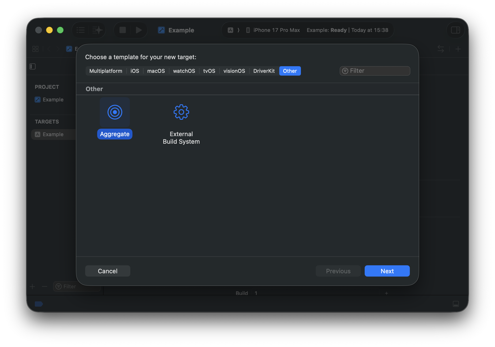
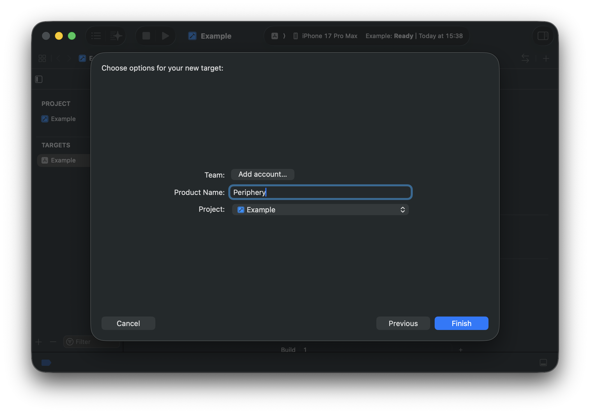
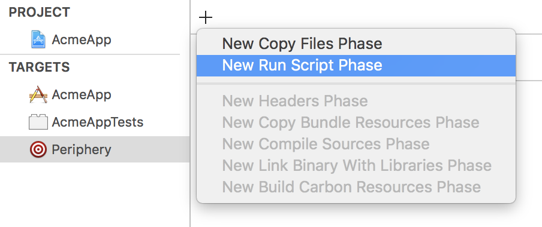
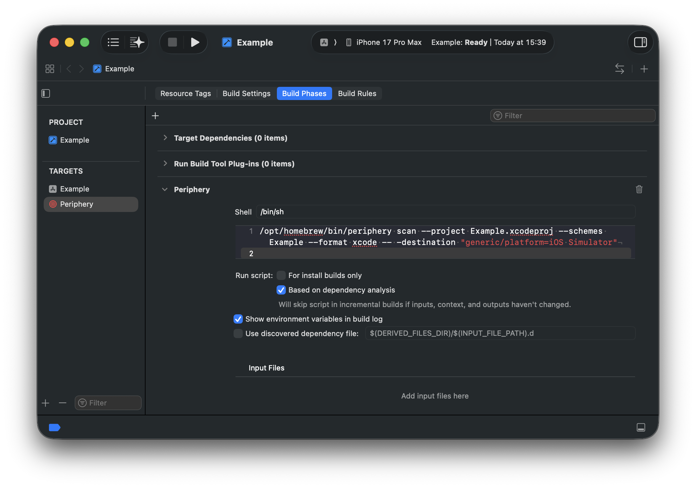
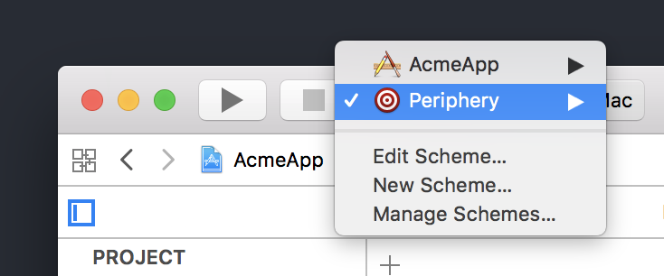

<h1 align="center">
  
  <br>
  Periphery
</h1>

<h4 align="center">A tool to identify unused code in Swift projects.</h4>
<p align="center"><q><i>Now I have become Delete, the destroyer of codes.</i></q></p>

<p align="center">
<a href="https://github.com/peripheryapp/periphery/releases/latest">
</a>

<a href="#sponsors-">

</a>
<br>
<br>
</p>

## Contents

- [Installation](#installation)
- [How To Use](#how-to-use)
- [How It Works](#how-it-works)
- [Analysis](#analysis)
    - [Function Parameters](#function-parameters)
    - [Protocols](#protocols-1)
    - [Enumerations](#enumerations)
    - [Assign-only Properties](#assign-only-properties)
    - [Redundant Public Accessibility](#redundant-public-accessibility)
    - [Unused Imports](#unused-imports)
    - [Objective-C](#objective-c)
    - [Codable](#codable)
    - [XCTestCase](#xctestcase)
    - [Interface Builder](#interface-builder)
- [Comment Commands](#comment-commands)
- [Xcode Integration](#xcode-integration)
- [Excluding Files](#excluding-files)
- [Continuous Integration](#continuous-integration)
- [Build Systems](#build-systems)
- [Platforms](#platforms)
- [Troubleshooting](#troubleshooting)
- [Known Bugs](#known-bugs)
- [Sponsors](#sponsors-) 

## Installation

### [Homebrew](https://brew.sh/)

```sh
brew install peripheryapp/periphery/periphery
```

### [Mint](https://github.com/yonaskolb/mint)

```sh
mint install peripheryapp/periphery
```

### [CocoaPods](https://cocoapods.org/)

Add the following to your Podfile:

```ruby
pod 'Periphery'
```

Now run `pod install`, the Periphery executable will be downloaded and placed at `Pods/Periphery/periphery`.

## How To Use

### The `scan` Command

The scan command is Periphery's primary function. To begin a guided setup, simply change to your project directory and run:

```sh
periphery scan --setup
```

> Guided setup only works for Xcode and SwiftPM projects, to use Periphery with non-Apple build systems such as Bazel, see [Build Systems](#build-systems).

After answering a few questions, Periphery will print out the full scan command and execute it.

The guided setup is only intended for introductory purposes, once you are familiar with Periphery you can try some more advanced options, all of which can be seen with `periphery help scan`.

To get coherent results from Periphery, it's crucial to understand the implications of the build targets you choose to analyze. For example, imagine a project consisting of three targets: App, Lib and Tests. The App target imports Lib, and the Tests targets imports both App and Lib. If you were to provide all three to the `--targets` option then Periphery will be able to analyze your project as a whole. However, if you only choose to analyze App and Lib, but not Tests, Periphery may report some instances of unused code that are _only_ referenced by Tests. Therefore when you suspect Periphery has provided an incorrect result, it's important to consider the targets that you have chosen to analyze.

If your project consists of one or more standalone frameworks that do not also contain some kind of application that consume their interfaces, then you'll need to tell Periphery to assume that all public declarations are in fact used by including the `--retain-public` option.

For projects that are mixed Objective-C & Swift, it's highly recommend you [read about the implications](#objective-c) this can have on your results.

### Configuration

Once you've settled upon the appropriate options for your project, you may wish to persist them in a YAML configuration file. The simplest way to achieve this is to run Periphery with the `--verbose` option. Near the beginning of the output you will see the `[configuration:begin]` section with your configuration formatted as YAML below. Copy & paste the configuration into `.periphery.yml` in the root of your project folder. You can now simply run `periphery scan` and the YAML configuration will be used.

## How It Works

Periphery first builds your project. For Xcode projects the schemes provided via the `--schemes` option are built using `xcodebuild`. For Swift Package Manager projects, the individual targets provided via the `--targets` option are built using `swift build`. The Swift compiler employs a technique called index-while-building to populate an index store that contains information about the structure of your project's source code.

After your project is built, Periphery performs an indexing phase. For every source file that is a member of the targets provided via the `--targets` option, Periphery obtains its structural information from the index store and builds its own internal graph representation of your project. Periphery also analyzes each file's abstract syntax tree (AST) to fill in some details not provided by the index store.

Once indexing is complete, Periphery analyzes the graph to identify unused code. This phase consists of a number of steps that mutate the graph to make it easier to identify specific scenarios of unused code. The final step walks the graph from its roots to identify declarations that are no longer referenced.

## Analysis

The goal of Periphery is to report instances of unused _declarations_. A declaration is a `class`, `struct`, `protocol`, `function`, `property`, `constructor`, `enum`, `typealias`, `associatedtype`, etc. As you'd expect, Periphery is able to identify simple unreferenced declarations, e.g a `class` that is no longer used anywhere in your codebase.

Periphery can also identify more advanced instances of unused code. The following section explains these in detail.

### Function Parameters

Periphery can identify unused function parameters. Instances of unused parameters can also be identified in protocols and their conforming declarations, as well as parameters in overridden methods. Both of these scenarios are explained further below.

#### Protocols

An unused parameter of a protocol function will only be reported as unused if the parameter is also unused in all implementations.

```swift
protocol Greeter {
    func greet(name: String)
    func farewell(name: String) // 'name' is unused
}

class InformalGreeter: Greeter {
    func greet(name: String) {
        print("Sup " + name + ".")
    }

    func farewell(name: String) { // 'name' is unused
      print("Cya.")
    }
}
```

> **Tip**
>
> You can ignore all unused parameters from protocols and conforming functions with the `--retain-unused-protocol-func-params` option.

#### Overrides

Similar to protocols, parameters of overridden functions are only reported as unused if they're also unused in the base function and all overriding functions.

```swift
class BaseGreeter {
    func greet(name: String) {
        print("Hello.")
    }

    func farewell(name: String) { // 'name' is unused
        print("Goodbye.")
    }
}

class InformalGreeter: BaseGreeter {
    override func greet(name: String) {
        print("Sup " + name + ".")
    }

    override func farewell(name: String) { // 'name' is unused
        print("Cya.")
    }
}
```

#### Foreign Protocols & Classes

Unused parameters of protocols or classes defined in foreign modules (e.g Foundation) are always ignored, since you do not have access to modify the base function declaration.

#### fatalError Functions

Unused parameters of functions that simply call `fatalError` are also ignored. Such functions are often unimplemented required initializers in subclasses.

```swift
class Base {
    let param: String

    required init(param: String) {
        self.param = param
    }
}

class Subclass: Base {
    init(custom: String) {
        super.init(param: custom)
    }

    required init(param: String) {
        fatalError("init(param:) has not been implemented")
    }
}
```

### Protocols

A protocol which is conformed to by an object is not truly used unless it's also used as an existential type, or to specialize a generic method/class. Periphery is able to identify such redundant protocols whether they are conformed to by one, or even multiple objects.

```swift
protocol MyProtocol { // 'MyProtocol' is redundant
    func someMethod()
}

class MyClass1: MyProtocol { // 'MyProtocol' conformance is redundant
    func someMethod() {
        print("Hello from MyClass1!")
    }
}

class MyClass2: MyProtocol { // 'MyProtocol' conformance is redundant
    func someMethod() {
        print("Hello from MyClass2!")
    }
}

let myClass1 = MyClass1()
myClass1.someMethod()

let myClass2 = MyClass2()
myClass2.someMethod()
```

Here we can see that despite both implementations of `someMethod` are called, at no point does an object take on the type of `MyProtocol`. Therefore the protocol itself is redundant, and there's no benefit from `MyClass1` or `MyClass2` conforming to it. We can remove `MyProtocol` along with each redundant conformance, and just keep `someMethod` in each class.

Just like a normal method or property of a object, individual properties and methods declared by your protocol can also be identified as unused.

```swift
protocol MyProtocol {
    var usedProperty: String { get }
    var unusedProperty: String { get } // 'unusedProperty' is unused
}

class MyConformingClass: MyProtocol {
    var usedProperty: String = "used"
    var unusedProperty: String = "unused" // 'unusedProperty' is unused
}

class MyClass {
    let conformingClass: MyProtocol

    init() {
        conformingClass = MyConformingClass()
    }

    func perform() {
        print(conformingClass.usedProperty)
    }
}

let myClass = MyClass()
myClass.perform()
```

Here we can see that `MyProtocol` is itself used, and cannot be removed. However, since `unusedProperty` is never called on `MyConformingClass`, Periphery is able to identify that the declaration of `unusedProperty` in `MyProtocol` is also unused and can be removed along with the unused implementation of `unusedProperty`.

### Enumerations

Along with being able to identify unused enumerations, Periphery can also identify individual unused enum cases. Plain enums that are not raw representable, i.e that _don't_ have a `String`, `Character`, `Int` or floating-point value type can be reliably identified. However, enumerations that _do_ have a raw value type can be dynamic in nature, and therefore must be assumed to be used.

Let's clear this up with a quick example:

```swift
enum MyEnum: String {
    case myCase
}

func someFunction(value: String) {
    if let myEnum = MyEnum(rawValue: value) {
        somethingImportant(myEnum)
    }
}
```

There's no direct reference to the `myCase` case, so it's reasonable to expect it _might_ no longer be needed, however if it were removed we can see that `somethingImportant` would never be called if `someFunction` were passed the value of `"myCase"`.

### Assign-only Properties

Properties that are assigned but never used are identified as such, e.g:

```swift
class MyClass {
    var assignOnlyProperty: String // 'assignOnlyProperty' is assigned, but never used

    init(value: String) {
        self.assignOnlyProperty = value
    }
}
```

In some cases this may be the intended behavior, therefore you have a few options available to silence such results:

- Retain individual properties using [Comment Commands](#comment-commands).
- Retain all assign-only properties by their type with `--retain-assign-only-property-types`. Given types must match their exact usage in the property declaration (sans optional question mark), e.g `String`, `[String]`, `Set<String>`. Periphery is unable to resolve inferred property types, therefore in some instances you may need to add explicit type annotations to your properties.
- Disable assign-only property analysis entirely with `--retain-assign-only-properties`.

### Redundant Public Accessibility

Declarations that are marked `public` yet are not referenced from outside their home module, are identified as having redundant public accessibility. In this scenario, the `public` annotation can be removed from the declaration. Removing redundant public accessibility has a couple of benefits:

- It helps reduce the public surface area of your modules.
- In [Whole Module Compilation](https://github.com/apple/swift/blob/main/docs/OptimizationTips.rst#whole-module-optimizations-wmo) mode, Swift can infer `final` by [automatically discovering](https://github.com/apple/swift/blob/main/docs/OptimizationTips.rst#advice-if-wmo-is-enabled-use-internal-when-a-declaration-does-not-need-to-be-accessed-outside-of-module) all potentially overriding declarations. `final` classes are [better optimized](https://github.com/apple/swift/blob/main/docs/OptimizationTips.rst#advice-use-final-when-you-know-the-declaration-does-not-need-to-be-overridden) by the compiler.

This analysis can be disabled with `--disable-redundant-public-analysis`.

### Unused Imports

Periphery can detect unused imports of targets it has scanned, i.e. those specified with the `--targets` argument. It cannot detect unused imports of other targets because the Swift source files are unavailable and uses of `@_exported` cannot be observed. `@_exported` is problematic because it changes the public interface of a target such that the declarations exported by the target are no longer necessarily declared by the imported target. For example, the `Foundation` target exports `Dispatch`, among other targets. If any given source file imports `Foundation` and references `DispatchQueue` but no other declarations from `Foundation`, then the `Foundation` import cannot be removed as it would also make the `DispatchQueue` type unavailable. To avoid false positives, therefore, Periphery only detects unused imports of targets it has scanned.

Periphery will likely produce false positives for targets with mixed Swift and Objective-C, as Periphery cannot scan the Objective-C files. It is recommended therefore to disable unused import detection for projects with a significant amount of Objective-C, or manually exclude the mixed language targets from the results.

### Objective-C

Periphery cannot analyze Objective-C code since types may be dynamically typed.

By default Periphery does not assume that declarations accessible by the Objective-C runtime are in use. If your project is a mix of Swift & Objective-C, you can enable this behavior with the `--retain-objc-accessible` option. Swift declarations that are accessible by the Objective-C runtime are those that are explicitly annotated with `@objc` or `@objcMembers`, and classes that inherit `NSObject` either directly or indirectly via another class.

Alternatively, the `--retain-objc-annotated` can be used to only retain declarations that are explicitly annotated with `@objc` or `@objcMembers`. Types that inherit `NSObject` are not retained unless they have the explicit annotations. This option may uncover more unused code, but with the caveat that some of the results may be incorrect if the declaration is in fact used in Objective-C code. To resolve these incorrect results you must add an `@objc` annotation to the declaration.

### Codable

Swift synthesizes additional code for `Codable` types that is not visible to Periphery, and can result in false positives for properties not directly referenced from non-synthesized code. If your project contains many such types, you can retain all properties on `Codable` types with `--retain-codable-properties`. Alternatively, you can retain properties only on `Encodable` types with `--retain-encodable-properties`.

If `Codable` conformance is declared by a protocol in an external module not scanned by Periphery, you can instruct Periphery to identify the protocols as `Codable` with `--external-codable-protocols "ExternalProtocol"`.

### XCTestCase

Any class that inherits `XCTestCase` is automatically retained along with its test methods. However, when a class inherits `XCTestCase` indirectly via another class, e.g `UnitTestCase`, and that class resides in a target that isn't scanned by Periphery, you need to use the `--external-test-case-classes UnitTestCase` option to instruct Periphery to treat `UnitTestCase` as an `XCTestCase` subclass.

### Interface Builder

If your project contains Interface Builder files (such as storyboards and XIBs), Periphery will take these into account when identifying unused declarations. However, Periphery currently only identifies unused classes. This limitation exists because Periphery does not yet fully parse Interface Builder files (see [issue #212](https://github.com/peripheryapp/periphery/issues/212)). Due to Periphery's design principle of avoiding false positives, it is assumed that if a class is referenced in an Interface Builder file, all of its `IBOutlets` and `IBActions` are used, even if they might not be in reality. This approach will be revised to accurately identify unused `IBActions` and `IBOutlets` once Periphery gains the capability to parse Interface Builder files.

## Comment Commands

For whatever reason, you may want to keep some unused code. Source code comment commands can be used to ignore specific declarations, and exclude them from the results.

An ignore comment command can be placed directly on the line above any declaration to ignore it, and all descendent declarations:

```swift
// periphery:ignore
class MyClass {}
```

You can also ignore specific unused function parameters:

```swift
// periphery:ignore:parameters unusedOne,unusedTwo
func someFunc(used: String, unusedOne: String, unusedTwo: String) {
    print(used)
}
```

The `// periphery:ignore:all` command can be placed at the top of the source file to ignore the entire contents of the file. Note that the comment must be placed above any code, including import statements.

Comment commands also support trailing comments following a hyphen so that you can include an explanation on the same line:

```swift
// periphery:ignore - explanation of why this is necessary
class MyClass {}
```

## Xcode Integration

Before setting up Xcode integration, we highly recommend you first get Periphery working in a terminal, as you will be using the exact same command via Xcode.

### Step 1: Create an Aggregate Target

Select your project in the Project Navigator and click the + button at the bottom left of the Targets section. Select **Cross-platform** and choose **Aggregate**. Hit Next.



Choose a name for the new target, e.g "Periphery" or "Unused Code".



### Step 2: Add a Run Script Build Phase

In the **Build Phases** section click the + button to add a new Run Script phase.



In the shell script window enter the Periphery command. Be sure to include the `--format xcode` option.



### Step 3: Select & Run

You're ready to roll. You should now see the new scheme in the dropdown. Select it and hit run.

> **Tip**
>
> If you'd like others on your team to be able to use the scheme, you'll need to mark it as _Shared_. This can be done by selecting _Manage Schemes..._ and selecting the _Shared_ checkbox next to the new scheme. The scheme definition can now be checked into source control.



## Excluding Files

Both exclusion options described below accept a Bash v4 style path glob, either absolute or relative to your project directory. You can delimit multiple globs with a space, e.g `--option "Sources/Single.swift" "**/Generated/*.swift" "**/*.{xib,storyboard}"`.

### Excluding Results

To exclude the results from certain files, pass the `--report-exclude <globs>` option to the `scan` command.

### Excluding Indexed Files

To exclude files from being indexed, pass the `--index-exclude <globs>` option to the `scan` command. Excluding files from the index phase means that any declarations and references contained within the files will not be seen by Periphery. Periphery will be behave as if the files do not exist. For example, this option can be used to exclude generated code that holds references to non-generated code, or exclude all `.xib` and `.storyboard` files that hold references to code.

### Retaining File Declarations

To retain all declarations in files, pass the `--retain-files <globs>` option to the `scan` command. This option is equivalent to adding a `// periphery:ignore:all` comment command at the top of each file.

## Continuous Integration

When integrating Periphery into a CI pipeline, you can potentially skip the build phase if your pipeline has already done so, e.g to run tests. This can be achieved using the `--skip-build` option. However, you also need to tell Periphery the location of the index store using `--index-store-path`. This location is dependent on your project type.

Note that when using `--skip-build` and `--index-store-path` it's vital that the index store contains data for all of the targets you specify via `--targets`. For example, if your pipeline previously built the targets 'App' and 'Lib', the index store will only contain data for the files in those targets. You cannot then instruct Periphery to scan additional targets, e.g 'Extension', or 'UnitTests'.

### Xcode

The index store generated by `xcodebuild` exists in DerivedData at a location dependent on your project, e.g `~/Library/Developer/Xcode/DerivedData/YourProject-abc123/Index/DataStore`. For Xcode 14 and later, the `Index` directory can be found as `Index.noindex`, which suppresses Spotlight indexing.

### SwiftPM

By default, Periphery looks for the index store at `.build/debug/index/store`. Therefore, if you intend to run Periphery directly after calling `swift test`, you can omit the `--index-store-path` option, and Periphery will use the index store created when the project was built for testing. However if this isn't the case, then you must provide Periphery the location of the index store with `--index-store-path`.

## Build Systems

Periphery can analyze projects using third-party build systems such as Bazel, though it cannot drive them automatically like SwiftPM and xcodebuild. Instead, you need to specify the index store location and provide a file-target mapping file.

A file-target mapping file contains a simple mapping of source files to build targets. You will need to generate this file yourself using the appropriate tooling for your build system. The format is as follows:

```json
{
  "file_targets": {
    "path/to/file_a.swift": ["TargetA"],
    "path/to/file_b.swift": ["TargetB", "TargetC"]
  }
}
```

> **Tip**
>
> Relative paths are assumed to be relative to the current directory.

You can then invoke periphery as follows:

```sh
periphery scan --file-targets-path map.json --index-store-path index/store
```

> **Tip**
>
> Both options support multiple paths.

## Platforms

Periphery supports both macOS and Linux. macOS supports both Xcode and Swift Package Manager (SPM) projects, whereas only SPM projects are supported on Linux.

## Troubleshooting

### Erroneous results in one or more files, such as false-positives and incorrect source file locations

It's possible for the index store to become corrupt, or out of sync with the source file. This can happen, for example, if you forcefully terminate (^C) a scan. To rectify this, you can pass the `--clean-build` flag to the scan command to force removal of existing build artifacts.

### Code referenced within preprocessor macro conditional branch is unused

When Periphery builds your project it uses the default build configuration, which is typically 'debug'. If you use preprocessor macros to conditionally compile code, Periphery will only have visibility into the branches that are compiled. In the example below, `releaseName` will be reported as unused as it is only referenced within the non-debug branch of the macro.

```swift
struct BuildInfo {
    let debugName = "debug"
    let releaseName = "release" // 'releaseName' is unused

    var name: String {
        #if DEBUG
        debugName
        #else
        releaseName
        #endif
    }
}
```

You've a few options to workaround this:

- Use [Comment Commands](#comment-commands) to explicitly ignore `releaseName`.
- Filter the results to remove known instances.
- Run Periphery once for each build configuration and merge the results. You can pass arguments to the underlying build by specifying them after `--`, e.g `periphery scan ... -- -configuration release`.

### Swift package is platform-specific

Periphery uses `swift build` to compile a Swift package which will fail if the Swift package is platform-specific (e.g. to iOS).

As a workaround, you can manually build the Swift package with `xcodebuild` and then use the `--skip-build` and `--index-store-path` options to target the index store previously produced by `xcodebuild`.

Example:

```sh
# 1. use xcodebuild
xcodebuild -scheme MyScheme -destination 'platform=iOS Simulator,OS=16.2,name=iPhone 14' -derivedDataPath '../dd' clean build

# 2. use produced index store for scanning
periphery scan --skip-build --index-store-path '../dd/Index.noindex/DataStore/'
```

## Known Bugs

Due to some underlying bugs in Swift, Periphery may in some instances report incorrect results.

| ID    | Title |
| :---  | :---  |
| [56559](https://github.com/apple/swift/issues/56559) | Index store does not relate constructor referenced via Self |
| [56541](https://github.com/apple/swift/issues/56541) | Index store does not relate static property getter used as subscript key |
| [56327](https://github.com/apple/swift/issues/56327) | Index store does not relate objc optional protocol method implemented in subclass |
| [56189](https://github.com/apple/swift/issues/56189) | Index store should relate appendInterpolation from string literals |
| [56165](https://github.com/apple/swift/issues/56165) | Index store does not relate constructor via literal notation |
| [49641](https://github.com/apple/swift/issues/49641) | Index does not include reference to constructor of class/struct with generic types |

## Sponsors 

Periphery is passion project that takes a huge amount of effort to maintain and develop. If you find Periphery useful, please consider sponsoring through [GitHub Sponsors](https://github.com/sponsors/peripheryapp).

Special thanks goes to the following generous sponsors:

### Emerge Tools

[Emerge Tools](https://www.emergetools.com) is a suite of revolutionary products designed to supercharge mobile apps and the teams that build them.

<a href="https://www.emergetools.com" alt="Emerge Tools">
    <picture>
        <source media="(prefers-color-scheme: dark)" srcset="https://github.com/peripheryapp/periphery/raw/master/assets/sponsors/emerge-tools-vertical-white.svg">
        <source media="(prefers-color-scheme: light)" srcset="https://github.com/peripheryapp/periphery/raw/master/assets/sponsors/emerge-tools-vertical-black.svg">
        
    </picture>
</a>
